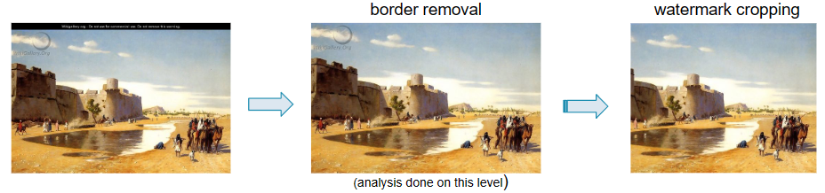
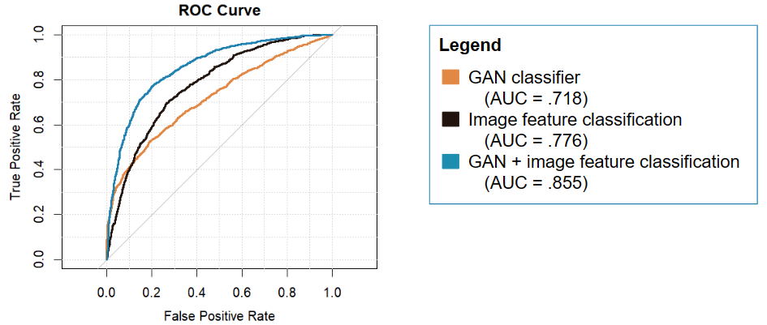

# Datathon 2023 Case Competition
**Host**: KU Leuven & LStat

**Team**: The Curse of Dimensionality

**Topic**: The code in this repository investigates possible factors that may help an existing GAN model discern between real and artificially generated artworks. The project was awarded *Best Modeling Datathon 2023*.

## Project overview

 

1. **Preprocessing**
    - Image preprocessing
      - Remove censored AI generated images
      - Remove WikiGallery border
      - Watermark cropping
    - Tabular data
      - Feature inspection
 
 2. **Feature engineering** 
    - Artist & artwork clustering (*Neo4j*)
    - Number of recommendations per artwork as a proxy for popularity (*Neo4j*)
    - Image feature extraction (???)
    
 

3. **Image classification**
    - assuming:
      - equal misclassification costs
      - equal number of AI generated and traditional artworks
    - Final models:
      - GAN classifier (*ResNet50 NoDown*)
      - Image feature classifier (logistic regression)
      - GAN + image feature classifier (logistic regression)

4. **Model inspection using logistic regressions and XGBoost** 

## Data information
The datasets, provided by KU Leuven, can be found in the FilesCSVFormat folder and include:
  - Data scraped from Wikipedia and meta-data of artists and artworks
  - Links to WikiGallery images for each artwork
  - Dataframe of AI generated images using a text-to-image model
  - Information and Entity-Relation diagram on the datasets provided

## Documentation
  - Data Processing: tabular processing and image preprocessing of scripts and dataframes 
  - GAN Detection: outputs using an existing GAN model based on resnet50
  - Image Features: outputs of feature extractions of images 
  - Data Analysis: exploratory analyses using logistic regression and XGBoost
  - Pitch: slides and images
